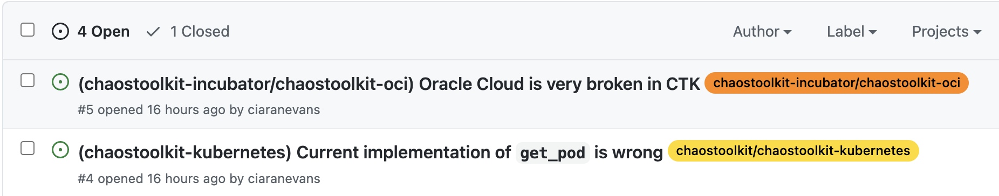

# chaostoolkit-issues-playground
Ciarans Playground for centralising/tagging/automating/tending to issues 

## Issue Tagging

I took inspiration from how AWS CDK does their [issue tagging](https://github.com/aws/aws-cdk/blob/master/.github/workflows/issue-label-assign.yml) and created `.github/workflows/label-issue.yaml`.

This workflow is run any time an Issue is created/updated and will regexp for `(repo-name)|(owner/repo-name)` in the Title and tag it with the appropriate label.

For example:

```
(chaostoolkit-kubernetes) Current implementation of get_pod is wrong
(chaostoolkit-incubator/chaostoolkit-oci) Oracle Cloud is very broken in CTK
```

Would appear like:


